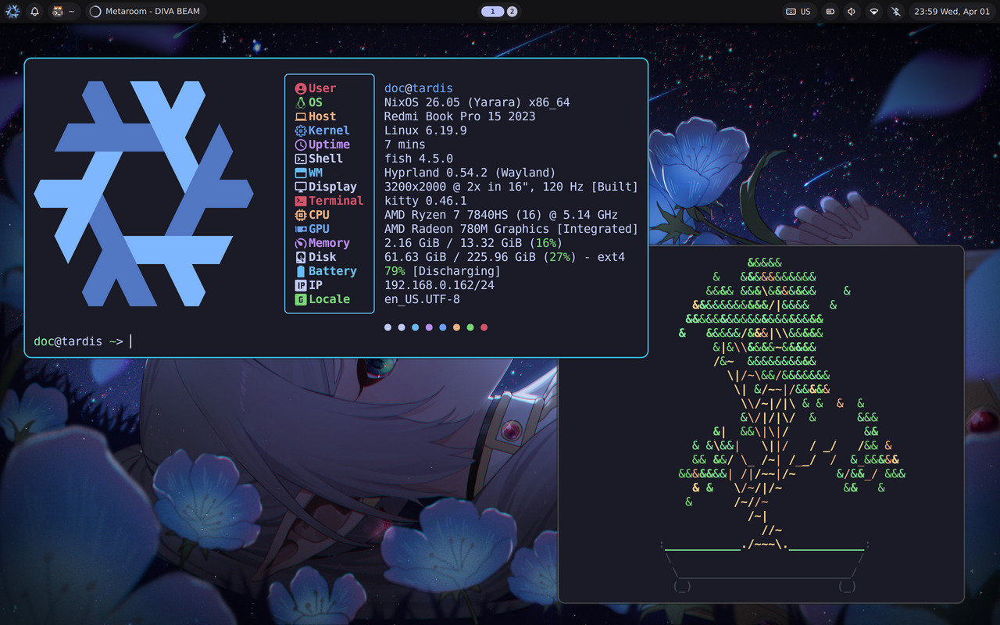

<h1 align="center"> Eka's dots </h1>



> [!NOTE]
> Thanks to [noctalia community of contributors](https://github.com/noctalia-dev/noctalia-shell/graphs/contributors) and their work creating [Noctalia](https://github.com/noctalia-dev/noctalia-shell).

## Installation

```
git clone https://github.com/Ekanel8/LimaNix
cd <path>/LimaNix
sudo nixos-rebuild switch --flake .
```

### This is MY configuration - there is no magic installer here. You can use it to study the nixos structure or take the module you need. It seems almost all of them are self-sufficient :0 The entire configuration was collected from many things I liked from various repositories and combined into these dotfiles

## Project Structure

```.
├── configuration.nix
├── flake.lock
├── flake.nix
├── hardware-configuration.nix
├── home.nix
├── img
│   ...
├── modules
│   ... (essentials)
│   ├── home
│   │   ... (.configs)
└── README.md
```
