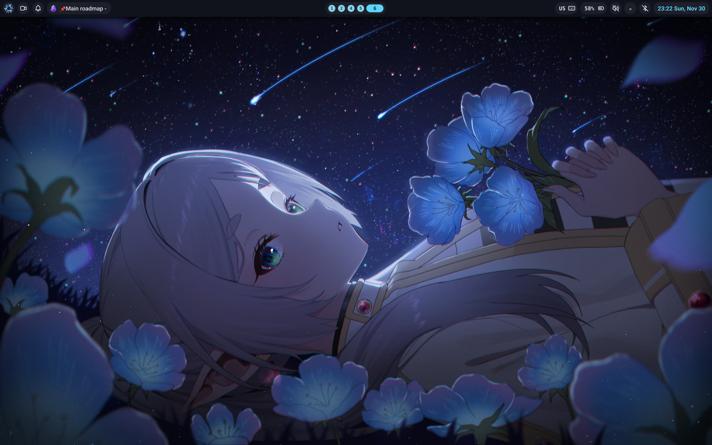

<h1>Bravo Dotfiles</h1>

> [!NOTE]
> Thanks to [noctalia community of contributors](https://github.com/noctalia-dev/noctalia-shell/graphs/contributors) and their work creating [Noctalia](https://github.com/noctalia-dev/noctalia-shell). At the moment, the Noctalia shell is used as the basis for the UI configuration.
